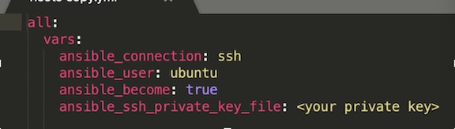
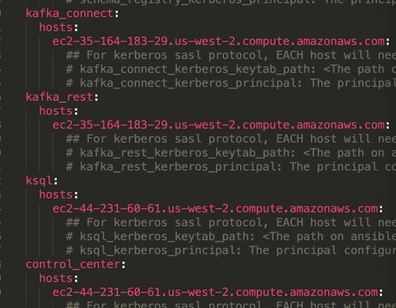
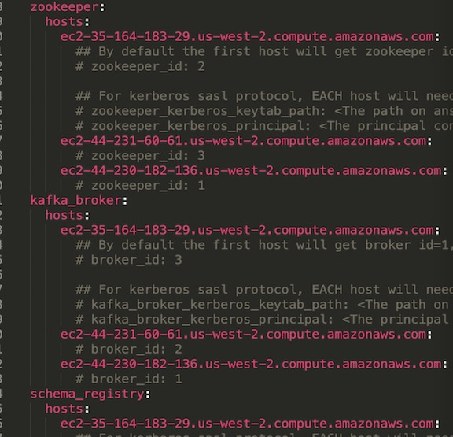
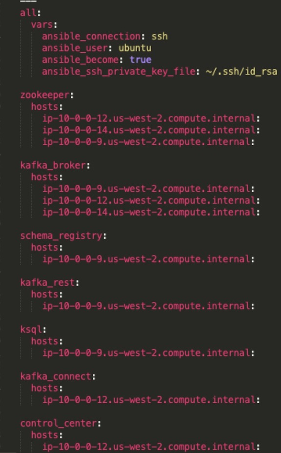

# Install Confluent Kafka on AWS using Ansible
This is an instruction to set up a Confluent Platform on AWS using the Ansible Playbook provided by the Confluent Platform. You can either run the Ansible script from your local laptop or from an EC2 instance on AWS, the difference is just switch public DNS/IP to private DNS/IP. 
[Here](https://docs.confluent.io/ansible/current/overview.html) and [here](https://www.confluent.jp/blog/confluent-platform-installation-with-cp-ansible/) please find more resources. 
## Install from your Laptop	

### Instructions

1. Install Ansible (2.7 or later) on your laptop;
2. Create at least 3 EC2 instances and make sure you have good security groups;
   * Use 2-Core/8GiB or above for the control center, t2.micro will NOT work well according to my tests.  
   * SSH to all the EC2s from your laptop and make sure the connection is good. Very important: do this before hosts.yml all -m ping (You’ll find what’s this later)
3. Download the Confluent Ansible Playbook to your laptop:
    *  `< git clone https://github.com/confluentinc/cp-ansible>`
4. Prepare Ansible Playbooks for Confluent Platform following [instructions here](https://docs.confluent.io/5.5.0/installation/cp-ansible/ansible-inventory.html)
5. Install Ansible Playbooks for Confluent Platform following [instructions here](https://docs.confluent.io/current/installation/cp-ansible/ansible-install.html)
6. if you run “hosts.yml all.yml” and failed, sometimes there will be issues when you try to make a new submission. I found two approaches are helpful:
    * Go to cp-ansible/roles/{" the specific module which the error occurs "}/tasks/main.yml, make the following edit: "force: yes"
    * If you don't want to edit the main.yml file, just destroy all your EC2s (terminate them all) and launch three more instances then start from scratch again. 
7. To validate your installation, access the Confluent Control Center interface by opening your web browser and navigate to the host and port where Control Center is running.
    * http://{ public DNS address or public IP }:9021/

### An example of hosts.yml

## Install from an EC2	

### Instructions

1. Create at least 4 EC2 instances and make sure you have good security groups;
    * Use 2-Core/8GiB or above for the control center, t2.micro will NOT work well according to my tests. 
    * The EC2 you’ll run Ansible on should be fine with any EC2 instances.
2. Install Ansible (2.7 or later) on one of the EC2s which you’ll install cp-Ansible;
    * From here, we call this EC2 as “cp_EC2”
    
        `< sudo apt-add-repository ppa:ansible/ansible>` 
        
        `< sudo apt-get update>` 
        
        `< sudo apt-get install ansible>` 
  
3. Setting up Keyless SSH following [this blog](https://blog.insightdatascience.com/simply-install-spark-cluster-mode-341843a52b88)  Step 0.5: Setting up Keyless SSH
    * Use  “cp_EC2” as the master node;
    * Test and make sure you can ssh from cp_EC2 to each EC2; 
4. Download Ansible Playbook to  “cp_EC2”
       
      `< git clone https://github.com/confluentinc/cp-ansible>` 
5. Prepare Ansible Playbooks for Confluent Platform following [instructions here](https://docs.confluent.io/5.5.0/installation/cp-ansible/ansible-inventory.html)
    * Use private DNS
6. Install Ansible Playbooks for Confluent Platform following [instructions here](https://docs.confluent.io/current/installation/cp-ansible/ansible-install.html)
7. A hosts.yml example can be found below.
8. If you have any issues during the installation or you need to adjust parameters during project development & optimization, please look into the instructions from the [Confluent website](https://docs.confluent.io/current/installation/installing_cp/deb-ubuntu.html#systemd-ubuntu-debian-install).
9. To validate your installation, access the Confluent Control Center interface by opening your web browser and navigate to the host and port where Control Center is running.
    * http://{ public DNS address or public IP }9021/

### An example of hosts.yml

{ width=50% } 
